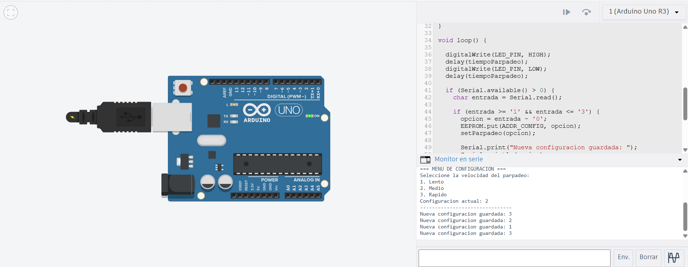

# Solución Reto 2

## Menú de Configuración Persistente

Diseñar un sistema de configuración simple que guarde la velocidad de parpadeo de un LED en la EEPROM y la restaure automáticamente al reiniciar el Arduino.
Descripción del funcionamiento
El programa permite al usuario seleccionar, mediante el Monitor Serie, entre tres velocidades de parpadeo:

Opción 1 → Lenta (1000 ms)
Opción 2 → Media (500 ms)
Opción 3 → Rápida (200 ms)

La selección se almacena de forma permanente en la EEPROM, usando EEPROM.put() y EEPROM.get().
Cada vez que el Arduino se enciende o reinicia, recupera la configuración guardada y aplica la velocidad seleccionada al parpadeo del LED sin necesidad de configurarla de nuevo.

```c
#include <EEPROM.h>

#define LED_PIN 13         
#define ADDR_CONFIG 0      

int opcion = 0;            
int tiempoParpadeo = 500;  // Valor por defecto (medio)

void setup() {
  Serial.begin(9600);
  pinMode(LED_PIN, OUTPUT);

  // Leer configuración almacenada en EEPROM
  EEPROM.get(ADDR_CONFIG, opcion);

  // Validar que el valor leído sea correcto
  if (opcion < 1 || opcion > 3) {
    opcion = 2; // Valor por defecto
  }


  setParpadeo(opcion);

  Serial.println("=== MENU DE CONFIGURACION ===");
  Serial.println("Seleccione la velocidad del parpadeo:");
  Serial.println("1. Lento");
  Serial.println("2. Medio");
  Serial.println("3. Rapido");
  Serial.print("Configuracion actual: ");
  Serial.println(opcion);
  Serial.println("-------------------------------");
}

void loop() {

  digitalWrite(LED_PIN, HIGH);
  delay(tiempoParpadeo);
  digitalWrite(LED_PIN, LOW);
  delay(tiempoParpadeo);

  if (Serial.available() > 0) {
    char entrada = Serial.read();

    if (entrada >= '1' && entrada <= '3') {
      opcion = entrada - '0';
      EEPROM.put(ADDR_CONFIG, opcion);
      setParpadeo(opcion);

      Serial.print("Nueva configuracion guardada: ");
      Serial.println(opcion);
    }
  }
}

void setParpadeo(int opcion) {
  switch (opcion) {
    case 1: tiempoParpadeo = 1000; break; // Lento
    case 2: tiempoParpadeo = 500;  break; // Medio
    case 3: tiempoParpadeo = 200;  break; // Rápido
  }
}
```

### Imagen del circuito:

