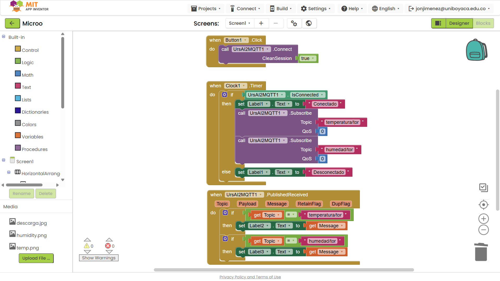
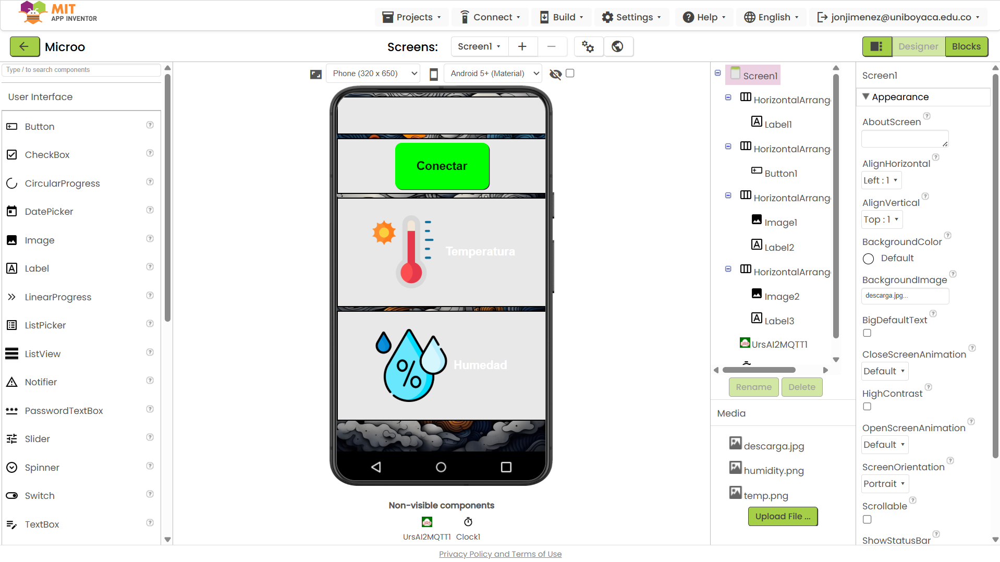

# CÓDIGO EXAMEN PARCIAL

## Funcionamiento

-> Lee temperatura y humedad del DHT11
-> Envía los datos al servidor MQTT público
-> Muestra los valores en una pantalla LCD I2C
-> Guarda las credenciales WiFi en la EEPROM
-> Divide el flujo en tres tareas con diferente prioridad usando FreeRTOS.

Explicación de las tareas y prioridades
Tarea --> Prioridad --> Función principal
taskReadSensor --> Alta (3) --> Lee temperatura y humedad del DHT11 cada 1s
taskSendMQTT --> Media (2) --> Envía los datos al broker MQTT
taskDisplayLCD --> Baja (1) --> Actualiza los valores en la LCD

Librerías necesarias:

-. WiFi.h
-. AsyncMqttClient
-. DHT.h
-. LiquidCrystal_I2C.h
-. EEPROM.h

### Código de Arduino:

```c
#include <WiFi.h>
#include <AsyncMqttClient.h>
#include <DHT.h>
#include <EEPROM.h>
#include <LiquidCrystal_I2C.h>


#define EEPROM_SIZE 100
#define DHTPIN 4
#define DHTTYPE DHT11

DHT dht(DHTPIN, DHTTYPE);
LiquidCrystal_I2C lcd(0x27, 16, 2);
AsyncMqttClient mqttClient;

// Broker MQTT
const char* mqttServer = "broker.emqx.io";
const int mqttPort = 1883;
const char* topic_temp = "temperatura/tor";
const char* topic_hum = "humedad/tor";

float temperatura = 0.0;
float humedad = 0.0;
SemaphoreHandle_t mutexData;

void guardarWiFiEEPROM(const char* ssid, const char* password) {
  EEPROM.begin(EEPROM_SIZE);
  for (int i = 0; i < 32; i++) EEPROM.write(i, ssid[i]);
  for (int i = 0; i < 64; i++) EEPROM.write(32 + i, password[i]);
  EEPROM.commit();
}

void leerWiFiEEPROM(char* ssid, char* password) {
  EEPROM.begin(EEPROM_SIZE);
  for (int i = 0; i < 32; i++) ssid[i] = EEPROM.read(i);
  for (int i = 0; i < 64; i++) password[i] = EEPROM.read(32 + i);
}

void conectarWiFi() {
  char ssid[33];
  char password[65];
  leerWiFiEEPROM(ssid, password);

  Serial.print("Conectando a WiFi: ");
  Serial.println(ssid);
  WiFi.begin(ssid, password);

  while (WiFi.status() != WL_CONNECTED) {
    delay(500);
    Serial.print(".");
  }
  Serial.println("\nWiFi conectado");
}

void onMqttConnect(bool sessionPresent) {
  Serial.println("Conectado al broker MQTT");
}

void onMqttDisconnect(AsyncMqttClientDisconnectReason reason) {
  Serial.println("Desconectado del broker MQTT. Reintentando...");
  delay(5000);
  mqttClient.connect();
}

// ------------------- TAREAS -------------------

//TAREA 1 - PRIORIDAD ALTA: Lectura del DHT11
void taskReadSensor(void * parameter) {
  for (;;) {
    float t = dht.readTemperature();
    float h = dht.readHumidity();

    if (!isnan(t) && !isnan(h)) {
      xSemaphoreTake(mutexData, portMAX_DELAY);
      temperatura = t;
      humedad = h;
      xSemaphoreGive(mutexData);
      Serial.printf("Sensor leído: T=%.2f°C H=%.2f%%\n", t, h);
    } else {
      Serial.println("Error leyendo DHT11");
    }
    vTaskDelay(pdMS_TO_TICKS(1000)); 
  }
}

//TAREA 2 - PRIORIDAD MEDIA: Enviar datos al broker MQTT
void taskSendMQTT(void * parameter) {
  for (;;) {
    if (mqttClient.connected()) {
      xSemaphoreTake(mutexData, portMAX_DELAY);
      float t = temperatura;
      float h = humedad;
      xSemaphoreGive(mutexData);

      char tempStr[8], humStr[8];
      dtostrf(t, 6, 2, tempStr);
      dtostrf(h, 6, 2, humStr);

      mqttClient.publish(topic_temp, 1, true, tempStr);
      mqttClient.publish(topic_hum, 1, true, humStr);

      Serial.printf("Datos enviados a MQTT -> T: %.2f°C | H: %.2f%%\n", t, h);
    }
    vTaskDelay(pdMS_TO_TICKS(2000)); 
  }
}

//TAREA 3 - PRIORIDAD BAJA: Mostrar datos en LCD
void taskDisplayLCD(void * parameter) {
  for (;;) {
    xSemaphoreTake(mutexData, portMAX_DELAY);
    float t = temperatura;
    float h = humedad;
    xSemaphoreGive(mutexData);

    lcd.clear();
    lcd.setCursor(0, 0);
    lcd.print("Temp: ");
    lcd.print(t, 1);
    lcd.print(" C");

    lcd.setCursor(0, 1);
    lcd.print("Hum: ");
    lcd.print(h, 1);
    lcd.print(" %");

    vTaskDelay(pdMS_TO_TICKS(3000)); 
  }
}

void setup() {
  Serial.begin(115200);
  dht.begin();
  lcd.init();
  lcd.backlight();

  conectarWiFi();

  mqttClient.onConnect(onMqttConnect);
  mqttClient.onDisconnect(onMqttDisconnect);
  mqttClient.setServer(mqttServer, mqttPort);
  mqttClient.connect();

  // Mutex para proteger variables compartidas
  mutexData = xSemaphoreCreateMutex();

  // Crear tareas FreeRTOS
  xTaskCreatePinnedToCore(taskReadSensor, "LeerSensor", 4096, NULL, 3, NULL, 1);
  xTaskCreatePinnedToCore(taskSendMQTT, "EnviarMQTT", 4096, NULL, 2, NULL, 1);
  xTaskCreatePinnedToCore(taskDisplayLCD, "MostrarLCD", 4096, NULL, 1, NULL, 1);
}

void loop() {
}
```

[](https://drive.google.com/file/d/1zGygeSoQFVGaJl_RtB38pUyT6QD7Z5vX/view?usp=sharing)


### Código de MIT APP Inventor

Estructura general del código:

La app usa tres bloques principales:

Botón de conexión (Button1.Click)
Reloj/temporizador (Clock1.Timer)
Recepción de datos (UrsAI2MQTT1.PublishedReceived)

1. Bloque: when Button1.Click
when Button1.Click
  call UrsAI2MQTT1.Connect
    CleanSession = true

--> Qué hace:
Cuando presionas el botón de conexión en la app:

Llama al componente UrsAI2MQTT1 (que es la extensión MQTT de App Inventor).
Le dice que se conecte al broker MQTT público (por ejemplo broker.emqx.io, configurado en el componente en el modo “Designer”).

CleanSession = true significa que no guarda suscripciones anteriores; cada vez que conectas, empieza limpio.

En palabras simples: Inicia la conexión MQTT cuando el usuario toca el botón "Conectar".

2. Bloque: when Clock1.Timer
if UrsAI2MQTT1.IsConnected
  set Label1.Text = "Conectado"
  call UrsAI2MQTT1.Subscribe Topic = "temperatura/tor"
  call UrsAI2MQTT1.Subscribe Topic = "humedad/tor"
else
  set Label1.Text = "Desconectado"

--> Qué hace:

Cada cierto tiempo (por ejemplo cada segundo si Clock1.Interval = 1000):

Verifica si la app está conectada al broker MQTT.
Si sí está conectada, cambia el texto del Label1 a "Conectado" y se suscribe a los dos temas:

temperatura/tor
humedad/tor

Si no está conectada, muestra "Desconectado" en la interfaz.

--> En palabras simples:
El reloj sirve para comprobar constantemente el estado de conexión y asegurarse de que la app siga recibiendo los datos del ESP32.

3. Bloque: when UrsAI2MQTT1.PublishedReceived
if Topic = "temperatura/tor"
  set Label2.Text = Message

if Topic = "humedad/tor"
  set Label3.Text = Message

--> Qué hace:

Cada vez que llega un mensaje publicado en alguno de los temas suscritos:

Revisa el nombre del topic.
Si es temperatura/tor, muestra el valor recibido (por ejemplo “27.5”) en Label2.
Si es humedad/tor, muestra el valor (por ejemplo “56.2”) en Label3.

--> En palabras simples:
Aquí la app recibe los datos del ESP32 y los actualiza en pantalla.

--> Ejemplo de flujo completo
Pulsas “Conectar” en la app → se conecta al broker MQTT.
El reloj detecta que la conexión fue exitosa → muestra “Conectado” y se suscribe a los temas.

El ESP32 publica:

temperatura/tor = 28.3
humedad/tor = 60.1

La app recibe esos mensajes → y los muestra en Label2 (temperatura) y Label3 (humedad).

#### Imagen de la APP:


