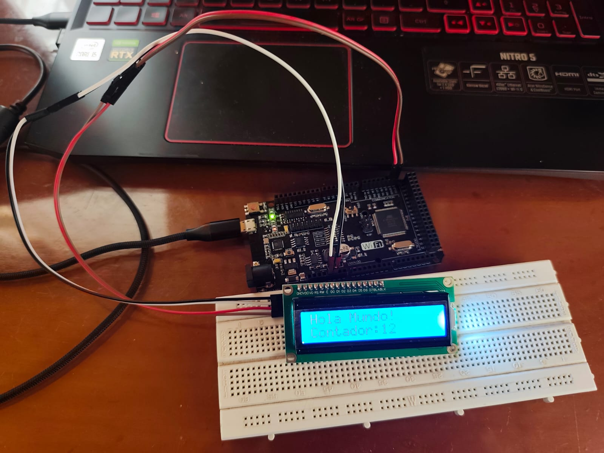

# Solución Reto 1

## Mostrar mensaje en LCD I2C

Mostrar texto en una pantalla LCD 16x2 usando I2C para simplificar conexiones.
Se imprimirá un mensaje de bienvenida y un contador que aumenta cada segundo.

```c
#include <Wire.h>
#include <LiquidCrystal_I2C.h>


#define LCD_ADDR 0x27
#define LCD_COLS 16
#define LCD_ROWS 2

LiquidCrystal_I2C lcd(LCD_ADDR, LCD_COLS, LCD_ROWS);

int contador = 0;

void setup() {
  // Inicializar LCD
  lcd.init();      
  lcd.backlight(); // Encender luz de fondo

  // Mensaje de bienvenida
  lcd.setCursor(0,0);
  lcd.print("Hola Mundo!");
  lcd.setCursor(0,1);
  lcd.print("Contador: 0");
}

void loop() {
  lcd.setCursor(9,1); 
  lcd.print(contador);
  contador++;

  delay(1000);
}
```


### Imagen del circuito:

