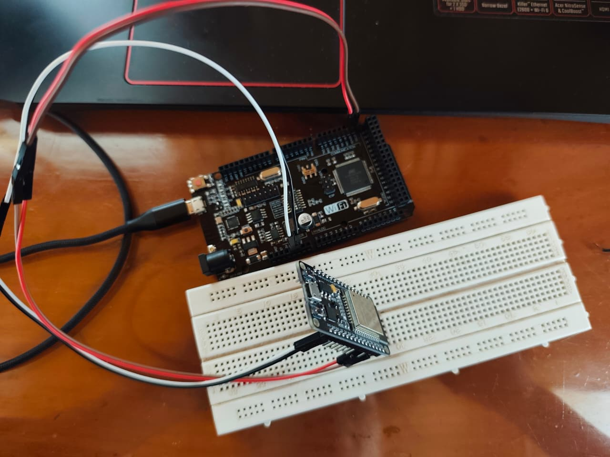

# Solución Reto 2

## Comunicación I2C Maestro–Esclavo

Enviar un número desde un Arduino Mega (Maestro) a un ESP32 (Esclavo) mediante I2C.
El ESP32 recibirá el dato y lo imprimirá en el Monitor Serial.

```c
Código Maestro (Arduino Mega)

#include <Wire.h>

#define ESCLAVO_ADDR 0x08  // Dirección del esclavo

int numero = 0;

void setup() {
  Wire.begin();           // Inicializar como maestro
  Serial.begin(9600);
}

void loop() {
  // Enviar número al esclavo
  Wire.beginTransmission(ESCLAVO_ADDR);
  Wire.write(numero);     // Enviar un byte
  Wire.endTransmission();

  Serial.print("Maestro envio: ");
  Serial.println(numero);

  numero++;               // Incrementar valor para el próximo envío
  delay(1000);            // Enviar cada 1 segundo
}


Código Escalavo (ESP32)

#include <Wire.h>

#define ESCLAVO_ADDR 0x08

void setup() {
  Serial.begin(9600);
  Wire.begin(ESCLAVO_ADDR);               // Inicializar como esclavo
  Wire.onReceive(receiveEvent);           // Función llamada al recibir datos
}

void loop() {
  // El loop puede estar vacío, la recepción es por interrupción
  delay(100);
}

// Función que se ejecuta cuando se recibe un byte del maestro
void receiveEvent(int howMany) {
  while (Wire.available()) {
    int recibido = Wire.read();           // Leer el dato recibido
    Serial.print("Esclavo recibio: ");
    Serial.println(recibido);
  }
}
```

### Imagen del circuito:

