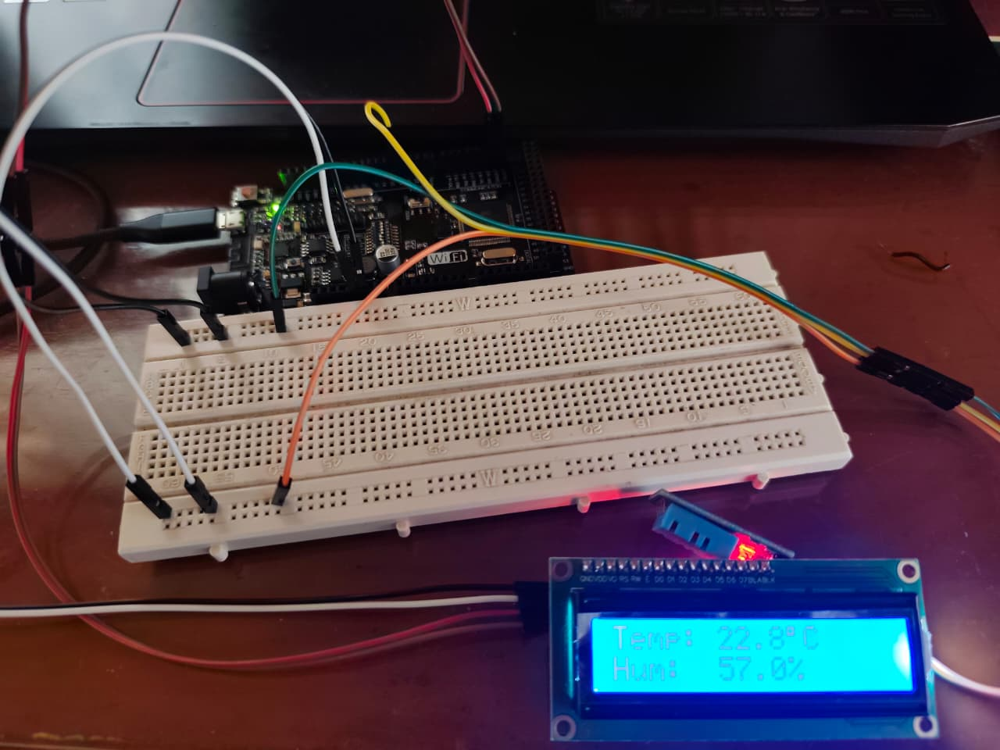

# Solución Reto 3

## Sensor DHT11 + Pantalla LCD I²C

Leer la temperatura y humedad del sensor DHT11 y mostrar los valores en una pantalla LCD 16x2 con I²C.

```c
#include <Wire.h>
#include <LiquidCrystal_I2C.h>
#include <DHT.h>

#define DHTPIN 4        
#define DHTTYPE DHT11
DHT dht(DHTPIN, DHTTYPE);

#define LCD_ADDR 0x27  
#define LCD_COLS 16
#define LCD_ROWS 2
LiquidCrystal_I2C lcd(LCD_ADDR, LCD_COLS, LCD_ROWS);

void setup() {
  Serial.begin(9600);


  dht.begin();
  lcd.init();
  lcd.backlight();

  // Mensaje inicial
  lcd.setCursor(0,0);
  lcd.print("Iniciando...");
  delay(2000);
  lcd.clear();
}

void loop() {
  float temperatura = dht.readTemperature(); // °C
  float humedad = dht.readHumidity();       // %

  // Validar lectura
  if (isnan(temperatura) || isnan(humedad)) {
    lcd.setCursor(0,0);
    lcd.print("Error DHT11     ");
    Serial.println("Error al leer DHT11");
  } else {
    // Mostrar en LCD
    lcd.setCursor(0,0);
    lcd.print("Temp: ");
    lcd.print(temperatura,1);
    lcd.print((char)223);
    lcd.print("C ");

    lcd.setCursor(0,1);
    lcd.print("Hum:  ");
    lcd.print(humedad,1);
    lcd.print("%      ");

    Serial.print("Temperatura: ");
    Serial.print(temperatura);
    Serial.print("C, Humedad: ");
    Serial.print(humedad);
    Serial.println("%");
  }

  delay(2000);
}
```

### Imagen del circuito:

