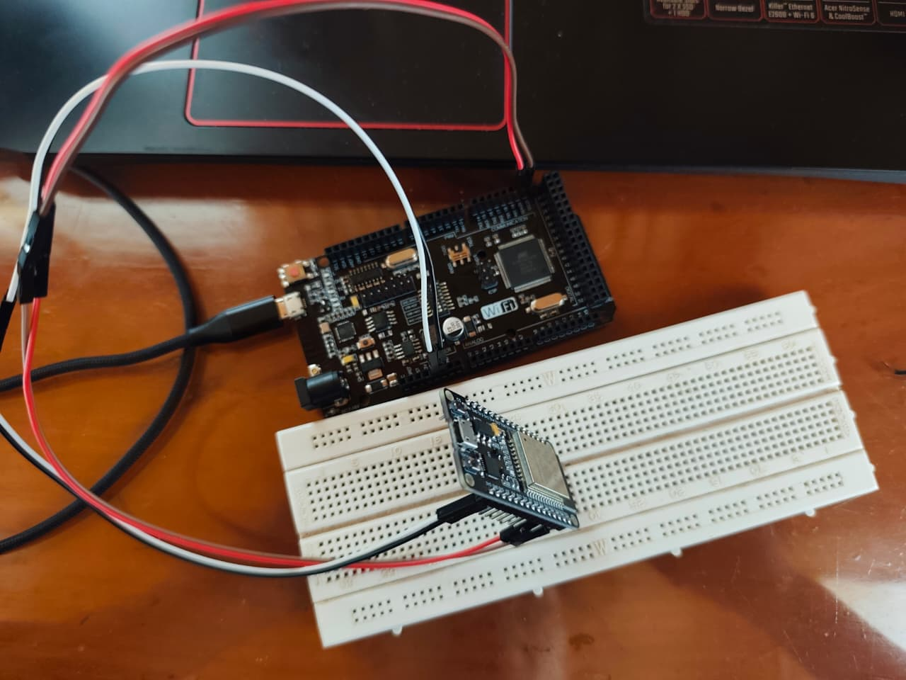

# Solución Reto 4

## Red Maestro–Esclavo con solicitudes

Implementar comunicación I2C entre un Arduino Maestro y un Esclavo sensor.
El maestro solicita datos en diferentes momentos (por ejemplo, temperatura, humedad).
El esclavo responde con la información solicitada.

```c
Código Maestro:

#include <Wire.h>

#define ESCLAVO_ADDR 0x08

void setup() {
  Serial.begin(9600);
  Wire.begin();  // Inicializar como maestro
}

void loop() {
  int valorSensor = leerSensor();

  Serial.print("Valor recibido del esclavo: ");
  Serial.println(valorSensor);

  delay(3000); // Solicita datos cada 3 segundos
}

// Función para solicitar datos al esclavo
int leerSensor() {
  int valor = 0;

  Wire.requestFrom(ESCLAVO_ADDR, 2); // Solicitar 2 bytes
  if (Wire.available() == 2) {
    int byteAlto = Wire.read();
    int byteBajo = Wire.read();
    valor = (byteAlto << 8) | byteBajo;
  }

  return valor;
}

Código Esclavo:

#include <Wire.h>

#define ESCLAVO_ADDR 0x08

void setup() {
  Serial.begin(9600);

  // Inicializar I2C como esclavo
  Wire.begin(ESCLAVO_ADDR);
  Wire.onRequest(responderSolicitud);  
}

void loop() {
  delay(100);
}

// Función llamada cuando el maestro solicita datos
void responderSolicitud() {
  int sensorValue = analogRead(A0);      
  Wire.write(sensorValue >> 8);      
  Wire.write(sensorValue & 0xFF);   
  Serial.print("Enviando al maestro: ");
  Serial.println(sensorValue);
}

```

### Imagen del circuito:

