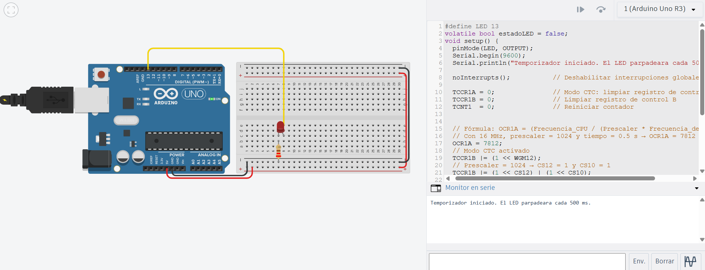

# Solución reto 3

## Explicación del temporizador interno para parpadeo preciso

En este reto se usa el temporizador interno Timer1 del Arduino configurado en modo CTC (Clear Timer on Compare Match) para generar una interrupción cada 500 ms.

Cada vez que se produce esta interrupción, se ejecuta una rutina (ISR), la cual invierte el estado de un LED (encendido ↔ apagado).

De esta forma, el parpadeo del LED se logra sin usar delay(), permitiendo que el microcontrolador pueda ejecutar otras tareas en el loop() sin ser bloqueado.

El modo CTC resetea automáticamente el contador del Timer1 cuando llega al valor indicado en el registro OCR1A, generando interrupciones precisas y periódicas.

```c
#define LED 13                
volatile bool estadoLED = false;  
void setup() {
  pinMode(LED, OUTPUT);
  Serial.begin(9600);
  Serial.println("Temporizador iniciado. El LED parpadeara cada 500 ms.");

  noInterrupts();           // Deshabilitar interrupciones globales

  TCCR1A = 0;               // Modo CTC: limpiar registro de control A
  TCCR1B = 0;               // Limpiar registro de control B
  TCNT1  = 0;               // Reiniciar contador

 
  // Fórmula: OCR1A = (Frecuencia_CPU / (Prescaler * Frecuencia_deseada)) - 1
  // Con 16 MHz, prescaler = 1024 y tiempo = 0.5 s → OCR1A = 7812
  OCR1A = 7812;
  // Modo CTC activado
  TCCR1B |= (1 << WGM12);
  // Prescaler = 1024 → CS12 = 1 y CS10 = 1
  TCCR1B |= (1 << CS12) | (1 << CS10);
  // Habilitar interrupción por comparación con OCR1A
  TIMSK1 |= (1 << OCIE1A);
  interrupts();             // Habilitar interrupciones globales
}

void loop() {
}
ISR(TIMER1_COMPA_vect) {
  estadoLED = !estadoLED;          
  digitalWrite(LED, estadoLED);    
}
```

### Imagen del circuito:

