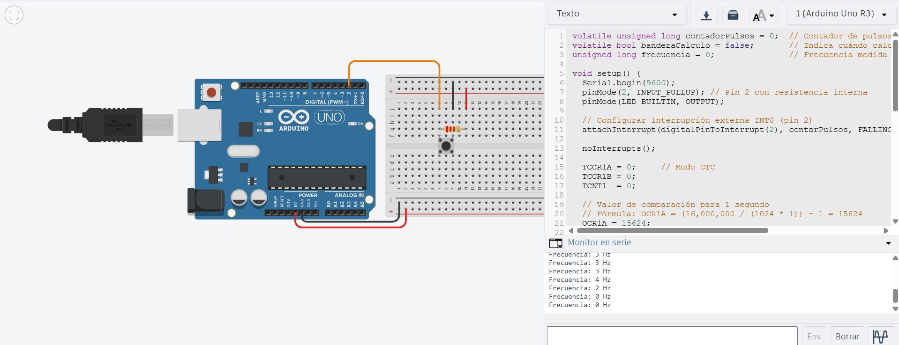

# Solución reto 4

## Explicación de la medición de frecuencia de una señal externa

En este reto se combinan dos tipos de interrupciones:
Interrupción externa (INT0) → Detecta los pulsos provenientes de un botón conectado al pin 2.
Cada vez que llega un pulso, se incrementa un contador de pulsos.
Interrupción interna (Timer1 en modo CTC) → Se configura para generar una interrupción cada 1 segundo (1000 ms).
En cada interrupción del temporizador, se calcula la frecuencia como el número de pulsos detectados durante ese segundo.
Luego se muestra la frecuencia (en Hz) por el Monitor Serial.

```c
volatile unsigned long contadorPulsos = 0;  // Contador de pulsos 
volatile bool banderaCalculo = false;       // Indica cuándo calcular la frecuencia
unsigned long frecuencia = 0;               // Frecuencia medida en Hz

void setup() {
  Serial.begin(9600);
  pinMode(2, INPUT_PULLUP); 
  pinMode(LED_BUILTIN, OUTPUT);

  attachInterrupt(digitalPinToInterrupt(2), contarPulsos, FALLING);

  noInterrupts(); 

  TCCR1A = 0;     // Modo CTC
  TCCR1B = 0;
  TCNT1  = 0;

  // Valor de comparación para 1 segundo
  // Fórmula: OCR1A = (16,000,000 / (1024 * 1)) - 1 = 15624
  OCR1A = 15624;
  TCCR1B |= (1 << WGM12);             // Activar modo CTC
  TCCR1B |= (1 << CS12) | (1 << CS10); // Prescaler 1024
  TIMSK1 |= (1 << OCIE1A);            // Habilitar interrupción del Timer1

  interrupts(); 

  Serial.println("Sistema iniciado. Midiendo frecuencia...");
}

void loop() {
  if (banderaCalculo) {
    banderaCalculo = false;  // Limpiar bandera
    frecuencia = contadorPulsos;  // Pulsos por segundo = frecuencia (Hz)
    contadorPulsos = 0;           // Reiniciar contador para el siguiente segundo

    Serial.print("Frecuencia: ");
    Serial.print(frecuencia);
    Serial.println(" Hz");

    digitalWrite(LED_BUILTIN, !digitalRead(LED_BUILTIN));
  }
}
void contarPulsos() {
  contadorPulsos++;  // Incrementar cada vez que llega un pulso
}
ISR(TIMER1_COMPA_vect) {
  banderaCalculo = true;  // Señal para realizar el cálculo en el loop()
}
```

### Imagen del circuito:

