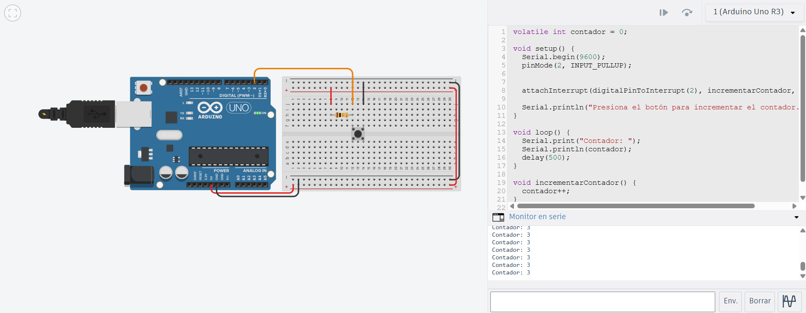

# Solución Reto 1

## Explicación del contador con botón mediante interrupción externa

En este reto se conecta un botón al pin digital 2 (INT0).
Cada vez que el botón se presiona, se genera una interrupción externa que incrementa una variable llamada contador.
Esto permite que el Arduino responda inmediatamente al evento del botón, sin necesidad de estar verificando su estado constantemente (sin polling).

El valor del contador se muestra en el Monitor Serial, permitiendo observar cómo aumenta cada vez que el botón se oprime.

```c
volatile int contador = 0;   

void setup() {
  Serial.begin(9600);          // Inicializar comunicación serial
  pinMode(2, INPUT_PULLUP);    // Pin 2 como entrada con resistencia interna pull-up
  
  attachInterrupt(digitalPinToInterrupt(2), incrementarContador, FALLING);

  Serial.println("Sistema iniciado. Presiona el botón para incrementar el contador.");
}

void loop() {
  // Mostrar el valor del contador continuamente
  Serial.print("Contador: ");
  Serial.println(contador);
  delay(500); // Pequeño retardo para no saturar el puerto serial
}

void incrementarContador() {
  contador++;  

```

### Imagen del circuito:

