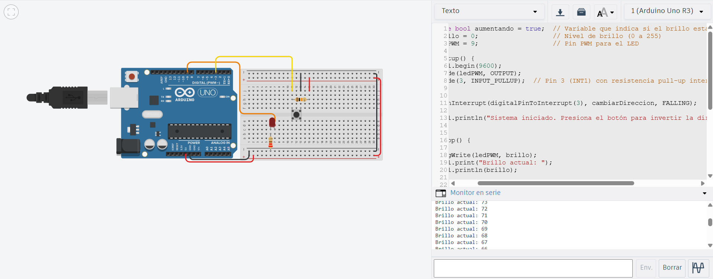

# Solución Reto 2

## Explicación del control de PWM con interrupción externa

En este reto se controla la intensidad de un LED usando señales PWM (modulación por ancho de pulso).
El brillo del LED aumenta o disminuye progresivamente mediante analogWrite().

Se conecta un botón al pin 3 (INT1), el cual genera una interrupción externa cada vez que se presiona.
Esta interrupción invierte la dirección del cambio del brillo:

Si el LED estaba aumentando su brillo, ahora comenzará a disminuirlo.

Si estaba disminuyendo, empezará a aumentarlo.

El uso de la interrupción permite cambiar la dirección en cualquier momento sin necesidad de detener el ciclo principal del programa.

```c
volatile bool aumentando = true;  // Variable que indica si el brillo está aumentando o disminuyendo
int brillo = 0;                   // Nivel de brillo (0 a 255)
int ledPWM = 9;                   // Pin PWM para el LED

void setup() {
  Serial.begin(9600);
  pinMode(ledPWM, OUTPUT);
  pinMode(3, INPUT_PULLUP);  // Pin 3 (INT1) con resistencia pull-up interna

  // Configurar interrupción externa en pin 3
  attachInterrupt(digitalPinToInterrupt(3), cambiarDireccion, FALLING);

  Serial.println("Sistema iniciado. Presiona el botón para invertir la dirección del brillo.");
}

void loop() {
  // Aplicar el valor de brillo al LED
  analogWrite(ledPWM, brillo);

  // Mostrar el valor en el monitor serial
  Serial.print("Brillo actual: ");
  Serial.println(brillo);

  // Control de dirección del brillo
  if (aumentando) {
    brillo++;
    if (brillo >= 255) aumentando = false;  // Límite superior
  } else {
    brillo--;
    if (brillo <= 0) aumentando = true;     // Límite inferior
  }

  delay(10); 
}

void cambiarDireccion() {
  aumentando = !aumentando; 
}

```

### Imagen del circuito:

