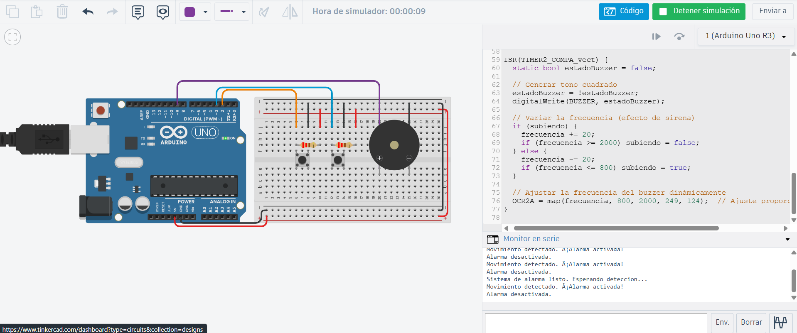

# Solución reto 5

## Explicación del sistema de alarma con múltiples interrupciones

En este reto se crea un sistema de alarma inteligente que combina interrupciones externas e internas para controlar diferentes eventos:
Un botón conectado al pin 2 (INT0) → Activa la alarma cuando detecta movimiento.
Botón de apagado en el pin 3 (INT1) → Detiene la alarma cuando se presiona.

Timer2 → Genera una interrupción periódica que cambia la frecuencia del buzzer, simulando una sirena que varía su tono.

Cuando la alarma está activa, el Timer2 produce interrupciones rápidas que alternan la señal del buzzer, generando un sonido vibrante.
El uso de múltiples interrupciones permite que el sistema sea reactivo e independiente del ciclo loop(), sin bloqueos ni retardos.

```c
#define BUZZER 9          // Pin del buzzer (PWM)
volatile bool alarmaActiva = false;  // Estado de la alarma
volatile int frecuencia = 1000;      // Frecuencia inicial en Hz
volatile bool subiendo = true;       // Control de tono variable

void setup() {
  Serial.begin(9600);
  pinMode(BUZZER, OUTPUT);
  pinMode(2, INPUT_PULLUP);   
  pinMode(3, INPUT_PULLUP);   

  attachInterrupt(digitalPinToInterrupt(2), activarAlarma, FALLING);  // Activar
  attachInterrupt(digitalPinToInterrupt(3), desactivarAlarma, FALLING); // Desactivar

  Serial.println("Sistema de alarma listo. Esperando deteccion...");
}

void loop() {
}

void activarAlarma() {
  if (!alarmaActiva) {
    alarmaActiva = true;
    Serial.println("Movimiento detectado. ¡Alarma activada!");
    iniciarTimer2(); 
  }
}

void desactivarAlarma() {
  if (alarmaActiva) {
    alarmaActiva = false;
    detenerTimer2();  
    digitalWrite(BUZZER, LOW);
    Serial.println("Alarma desactivada.");
  }
}
void iniciarTimer2() {
  noInterrupts();
  TCCR2A = 0;
  TCCR2B = 0;
  TCNT2 = 0;

  TCCR2A |= (1 << WGM21);
  TCCR2B |= (1 << CS22);

  OCR2A = 124;  // ~1 kHz
  TIMSK2 |= (1 << OCIE2A);  // Habilitar interrupción por comparación
  interrupts();
}

void detenerTimer2() {
  noInterrupts();
  TIMSK2 &= ~(1 << OCIE2A); // Deshabilitar interrupciones del Timer2
  TCCR2A = 0;
  TCCR2B = 0;
  interrupts();
}

ISR(TIMER2_COMPA_vect) {
  static bool estadoBuzzer = false;

  // Generar tono cuadrado
  estadoBuzzer = !estadoBuzzer;
  digitalWrite(BUZZER, estadoBuzzer);

  // Variar la frecuencia (efecto de sirena)
  if (subiendo) {
    frecuencia += 20;
    if (frecuencia >= 2000) subiendo = false;
  } else {
    frecuencia -= 20;
    if (frecuencia <= 800) subiendo = true;
  }

  // Ajustar la frecuencia del buzzer dinámicamente
  OCR2A = map(frecuencia, 800, 2000, 249, 124);  // Ajuste proporcional
}
```

### Imagen del circuito:

