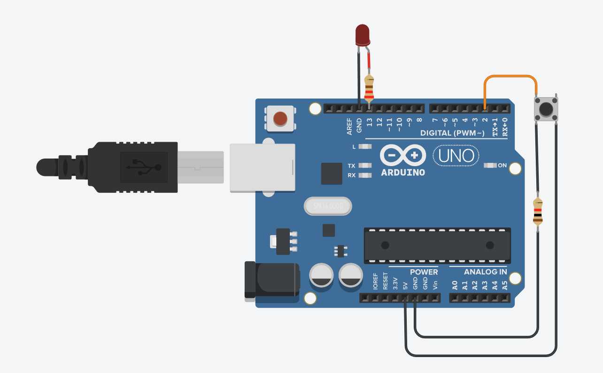

# Solucion reto 1

## Explicacion del encendido de un LED con un boton

Para encender el led, se lee la señal del botón (1 ó 0). Si la lectura del botón es 1, se enciende el led; si la lectura del botón en 0, se apaga  el boton.

```c
int pushButton = 2;  // Declaracion de vatriables y constantes
int ledPin = 13;
int statusButton;

void setup() {            //Lectura de pines
  Serial.begin(9600);
  pinMode(pushButton, INPUT);


}
void loop() {                             //Ciclo de trabajo
  statusButton = digitalRead(pushButton); //Lectura del boton = (0)
  Serial.println(statusButton);
  
  if (statusButton == HIGH){
    digitalWrite(ledPin, HIGH);
  }else{
    digitalWrite(ledPin, LOW);
}
}

```

#### Imagen del circuito:


