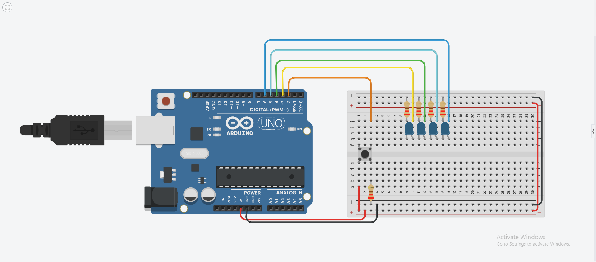

# Solucion reto 4

## Explicacion del contador binario con LEDs

Se creó un contador binario con 4 leds para reprecentar cada bit y por medio de un botón, se guarda en un contador la señal del botón para asociar dicho contador con un número binario como se muestra en la tabla. Al llegar al número 15 se reinicia la secuencia.

| Contador | Led A | Led B | Led C | Led D |
|--------|------|--------|--------| --------|
| 0 | 0 | 0 | 0 | 0 |
| 1 | 0 | 0 | 0 | 1 |
| 2 | 0 | 0 | 1 | 0 |
| 3 | 0 | 0 | 1 | 1 |
| 4 | 0 | 1 | 0 | 0 |
| 5 | 0 | 1 | 0 | 1 |
| 6 | 0 | 1 | 1 | 0 |
| 7 | 0 | 1 | 1 | 1 |
| 8 | 1 | 0 | 0 | 0 |
| 9 | 1 | 0 | 0 | 1 |
| 10| 1 | 0 | 1 | 0 |
| 11| 1 | 0 | 1 | 1 |
| 12| 1 | 1 | 0 | 0 |
| 13| 1 | 1 | 0 | 1 |
| 14| 1 | 1 | 1 | 0 |
| 15| 1 | 1 | 1 | 1 |


```c
int cont = 0;
int button = 2;
int statusBut;
int led1 = 3;
int led2 = 4;
int led3 = 5;
int led4 = 6;

void setup() {
  Serial.begin(9600);
  pinMode(button,INPUT);
}

void loop() {
  statusBut = digitalRead(button);
  if (statusBut == 1){
    cont = cont + 1;
    delay(1000);
  }
  if (cont == 1){
    digitalWrite(led1,LOW);
    digitalWrite(led2,LOW);
    digitalWrite(led3,LOW);
    digitalWrite(led4,HIGH);
  }
  if(cont == 2){
    digitalWrite(led1,LOW);
    digitalWrite(led2,LOW);
    digitalWrite(led3,HIGH);
    digitalWrite(led4,LOW);
  }
  if(cont == 3){
    digitalWrite(led1,LOW);
    digitalWrite(led2,LOW);
    digitalWrite(led3,HIGH);
    digitalWrite(led4,HIGH);
  }
  if(cont == 4){
    digitalWrite(led1,LOW);
    digitalWrite(led2,HIGH);
    digitalWrite(led3,LOW);
    digitalWrite(led4,LOW);
  }
  if(cont == 5){
    digitalWrite(led1,LOW);
    digitalWrite(led2,HIGH);
    digitalWrite(led3,LOW);
    digitalWrite(led4,HIGH);
  }
  if(cont == 6){
    digitalWrite(led1,LOW);
    digitalWrite(led2,HIGH);
    digitalWrite(led3,HIGH);
    digitalWrite(led4,LOW);
  }
  if(cont == 7){
    digitalWrite(led1,LOW);
    digitalWrite(led2,HIGH);
    digitalWrite(led3,HIGH);
    digitalWrite(led4,HIGH);
  }
  if(cont == 8){
    digitalWrite(led1,HIGH);
    digitalWrite(led2,LOW);
    digitalWrite(led3,LOW);
    digitalWrite(led4,LOW);
  }
  if(cont == 9){
    digitalWrite(led1,HIGH);
    digitalWrite(led2,LOW);
    digitalWrite(led3,LOW);
    digitalWrite(led4,HIGH);
  }
  if(cont == 10){
    digitalWrite(led1,HIGH);
    digitalWrite(led2,LOW);
    digitalWrite(led3,HIGH);
    digitalWrite(led4,LOW);
  }
  if(cont == 11){
    digitalWrite(led1,HIGH);
    digitalWrite(led2,LOW);
    digitalWrite(led3,HIGH);
    digitalWrite(led4,HIGH);
  }
  if(cont == 12){
    digitalWrite(led1,HIGH);
    digitalWrite(led2,HIGH);
    digitalWrite(led3,LOW);
    digitalWrite(led4,LOW);
  }
  if(cont == 13){
    digitalWrite(led1,HIGH);
    digitalWrite(led2,HIGH);
    digitalWrite(led3,LOW);
    digitalWrite(led4,HIGH);
  }
   if(cont == 14){
    digitalWrite(led1,HIGH);
    digitalWrite(led2,HIGH);
    digitalWrite(led3,HIGH);
    digitalWrite(led4,LOW);
  } 
  if(cont == 15){
    digitalWrite(led1,HIGH);
    digitalWrite(led2,HIGH);
    digitalWrite(led3,HIGH);
    digitalWrite(led4,HIGH);
  }
  if(cont == 16){
    digitalWrite(led1,LOW);
    digitalWrite(led2,LOW);
    digitalWrite(led3,LOW);
    digitalWrite(led4,LOW);
    cont = 0;
  }
  
  Serial.println(cont);
}

```
#### Imagen del circuito:



