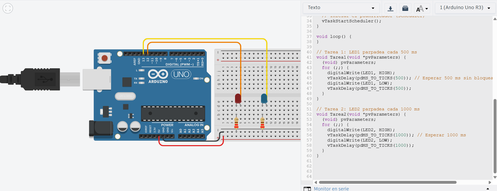

# Solución Reto 1

## Parpadeo Multitarea (Hello RTOS)

El propósito es que dos LEDs parpadeen a diferentes velocidades sin usar delay(), demostrando cómo el sistema operativo en tiempo real gestiona múltiples tareas de manera independiente, donde se crean dos tareas que corren en paralelo:

Tarea 1: Hace parpadear el LED 1 cada 500 ms.
Tarea 2: Hace parpadear el LED 2 cada 1000 ms.

Cada tarea usa su propia función y el scheduler de FreeRTOS se encarga de ejecutarlas concurrentemente.
Esto permite tener múltiples procesos que comparten el mismo microcontrolador sin bloquearse entre sí.

```c
#include <Arduino.h>
#define LED1 13
#define LED2 12

void Tarea1(void *pvParameters);
void Tarea2(void *pvParameters);

void setup() {
  Serial.begin(9600);
  pinMode(LED1, OUTPUT);
  pinMode(LED2, OUTPUT);

  // Crear Tarea 1: parpadeo cada 500 ms
  xTaskCreate(
    Tarea1,        // Función de la tarea
    "Parpadeo500", // Nombre descriptivo
    1000,          // Tamaño del stack
    NULL,          // Parámetro (no usado)
    1,             // Prioridad
    NULL           // Handle (no usado)
  );

  // Crear Tarea 2: parpadeo cada 1000 ms
  xTaskCreate(
    Tarea2,        // Función de la tarea
    "Parpadeo1000",
    1000,
    NULL,
    1,
    NULL
  );

  // Iniciar el planificador (scheduler)
  vTaskStartScheduler();
}

void loop() {
  // No se usa loop() en RTOS
}

// Tarea 1: LED1 parpadea cada 500 ms
void Tarea1(void *pvParameters) {
  (void) pvParameters;
  for (;;) {
    digitalWrite(LED1, HIGH);
    vTaskDelay(pdMS_TO_TICKS(500)); // Esperar 500 ms sin bloquear otras tareas
    digitalWrite(LED1, LOW);
    vTaskDelay(pdMS_TO_TICKS(500));
  }
}

// Tarea 2: LED2 parpadea cada 1000 ms
void Tarea2(void *pvParameters) {
  (void) pvParameters;
  for (;;) {
    digitalWrite(LED2, HIGH);
    vTaskDelay(pdMS_TO_TICKS(1000)); // Esperar 1000 ms
    digitalWrite(LED2, LOW);
    vTaskDelay(pdMS_TO_TICKS(1000));
  }
}
```

### Imagen del circuito:

