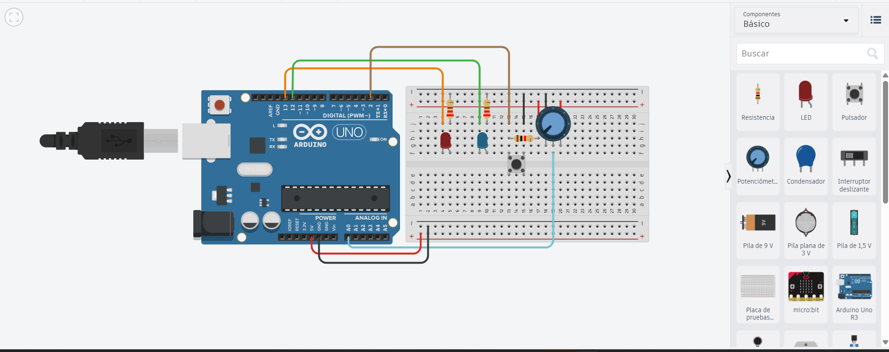

# Solución Reto 2

## Tareas con Diferentes Prioridades

El sistema contará con tres tareas concurrentes, cada una con un propósito distinto:

Tarea de baja prioridad:
Hace parpadear un LED cada 1000 ms (actividad continua y no crítica).

Tarea de prioridad media:
Lee un potenciómetro en el pin A0 y muestra su valor en el Monitor Serial cada 500 ms.

Tarea de alta prioridad:
Detecta la pulsación de un botón (pin 2) y enciende inmediatamente otro LED indicando una acción urgente.

```c
#include <Arduino.h>

#define LED_BAJA     13  // LED para tarea de baja prioridad
#define LED_ALTA     12  // LED de respuesta inmediata
#define BOTON        2   // Botón de entrada (pulldown)
#define POT_PIN      A0  // Potenciómetro


void TareaBaja(void *pvParameters);
void TareaMedia(void *pvParameters);
void TareaAlta(void *pvParameters);

void setup() {
  Serial.begin(9600);

  pinMode(LED_BAJA, OUTPUT);
  pinMode(LED_ALTA, OUTPUT);
  pinMode(BOTON, INPUT_PULLUP);

  // Crear Tarea de Baja Prioridad
  xTaskCreate(
    TareaBaja,           // Función asociada
    "LED_Baja",          // Nombre
    1000,                // Tamaño del stack
    NULL,                // Parámetros
    1,                   // Prioridad baja
    NULL
  );

  // Crear Tarea de Prioridad Media
  xTaskCreate(
    TareaMedia,
    "Lectura_Pot",
    1000,
    NULL,
    2,                   // Prioridad media
    NULL
  );

  // Crear Tarea de Alta Prioridad
  xTaskCreate(
    TareaAlta,
    "Boton_LED",
    1000,
    NULL,
    3,                   // Prioridad alta
    NULL
  );

  vTaskStartScheduler();
}

void loop() {
}

// Tarea de baja prioridad: Parpadeo cada 1 segundo
void TareaBaja(void *pvParameters) {
  (void) pvParameters;
  for (;;) {
    digitalWrite(LED_BAJA, HIGH);
    vTaskDelay(pdMS_TO_TICKS(500));
    digitalWrite(LED_BAJA, LOW);
    vTaskDelay(pdMS_TO_TICKS(500));
  }
}

// Tarea de prioridad media: Lectura de potenciómetro
void TareaMedia(void *pvParameters) {
  (void) pvParameters;
  for (;;) {
    int valor = analogRead(POT_PIN);
    Serial.print("Valor del Potenciometro: ");
    Serial.println(valor);
    vTaskDelay(pdMS_TO_TICKS(500));
  }
}

// Tarea de alta prioridad: Botón y LED inmediato
void TareaAlta(void *pvParameters) {
  (void) pvParameters;
  for (;;) {
    if (digitalRead(BOTON) == LOW) { // Pulldown → LOW = presionado
      digitalWrite(LED_ALTA, HIGH);
      Serial.println("Boton presionado → LED encendido (Tarea Alta Prioridad)");
      vTaskDelay(pdMS_TO_TICKS(300));
      digitalWrite(LED_ALTA, LOW);
    }
    vTaskDelay(pdMS_TO_TICKS(100)); // Pequeño tiempo de control
  }
}
```

### Imagen del circuito:

