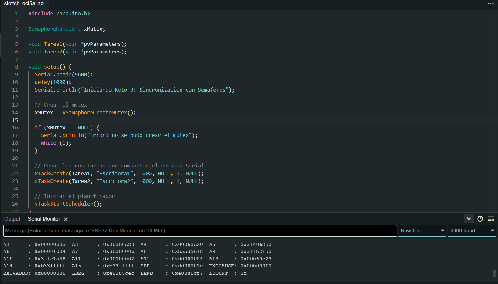

# Solución Reto 3.

## Sincronización de semáforos

En este reto se crean dos tareas concurrentes que intentan escribir en el mismo recurso (el puerto Serial). Si ambas escribieran sin control, los mensajes podrían intercalarse o mezclarse.

Para evitarlo, se usa un mutex (Mutual Exclusion Semaphore) que garantiza que solo una tarea a la vez acceda al recurso compartido.

```c
#include <Arduino.h>

SemaphoreHandle_t xMutex;  

void Tarea1(void *pvParameters);
void Tarea2(void *pvParameters);

void setup() {
  Serial.begin(9600);
  delay(1000);
  Serial.println("Iniciando Reto 3: Sincronizacion con Semaforos");

  // Crear el mutex
  xMutex = xSemaphoreCreateMutex();

  if (xMutex == NULL) {
    Serial.println("Error: no se pudo crear el mutex");
    while (1);
  }

  // Crear las dos tareas que comparten el recurso Serial
  xTaskCreate(Tarea1, "Escritora1", 1000, NULL, 1, NULL);
  xTaskCreate(Tarea2, "Escritora2", 1000, NULL, 1, NULL);

  // Iniciar el planificador
  vTaskStartScheduler();
}

void loop() {
}

// 🧵 Tarea 1: Escribe mensaje cada 700 ms
void Tarea1(void *pvParameters) {
  (void) pvParameters;
  for (;;) {
    // Intentar tomar el mutex
    if (xSemaphoreTake(xMutex, portMAX_DELAY) == pdTRUE) {
      Serial.println("Tarea 1 escribiendo en Serial...");
      vTaskDelay(pdMS_TO_TICKS(100)); // Simula tiempo de escritura
      Serial.println("Tarea 1 finalizo su escritura.\n");

      // Liberar el mutex
      xSemaphoreGive(xMutex);
    }

    vTaskDelay(pdMS_TO_TICKS(700)); // Espera antes de intentar otra escritura
  }
}

// 🧵 Tarea 2: Escribe mensaje cada 1000 ms
void Tarea2(void *pvParameters) {
  (void) pvParameters;
  for (;;) {
    if (xSemaphoreTake(xMutex, portMAX_DELAY) == pdTRUE) {
      Serial.println("Tarea 2 escribiendo en Serial...");
      vTaskDelay(pdMS_TO_TICKS(150)); // Simula tiempo de escritura
      Serial.println("Tarea 2 finalizo su escritura.\n");

      xSemaphoreGive(xMutex);
    }

    vTaskDelay(pdMS_TO_TICKS(1000));
  }
}
```

### Imagen del circuito:

