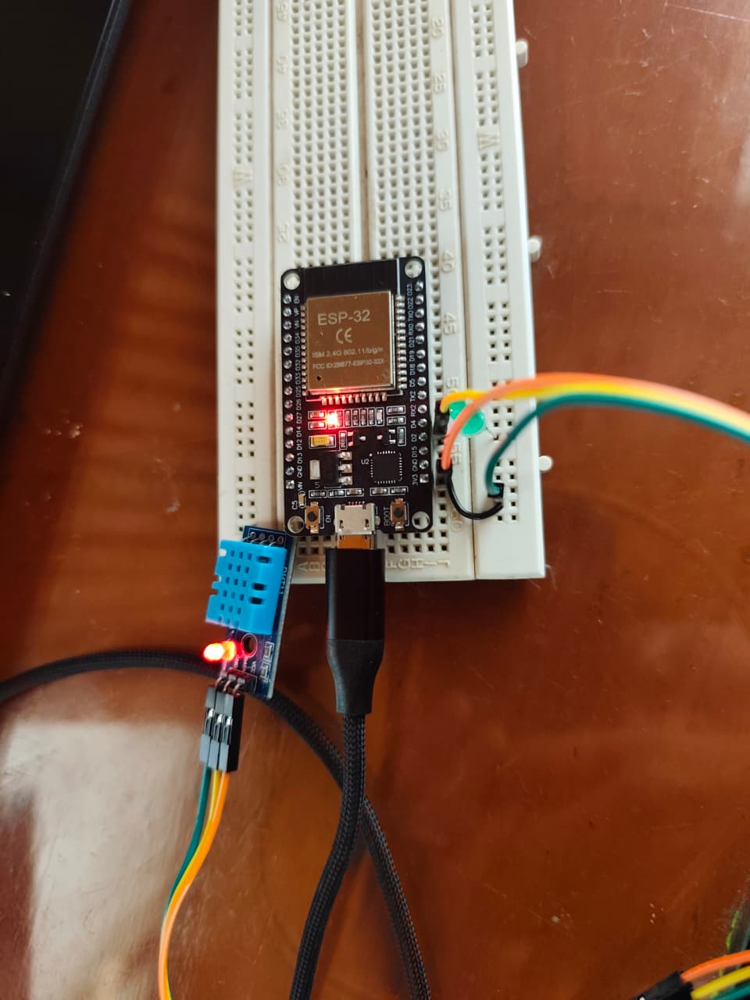

# Solución Reto 4: Colas de mensajes para comunicación entre tareas

## Objetivo

Implementar la comunicación entre tareas usando colas (QueueHandle_t) en FreeRTOS.
Una tarea leerá datos de un sensor DHT11, otra los procesará y encenderá un LED si la temperatura supera un umbral, y una tercera mostrará un mensaje de monitoreo.

```c
#include <Arduino.h>
#include <DHT.h>

#define DHTPIN 4
#define DHTTYPE DHT11
#define LED_PIN 2
#define UMBRAL_TEMP 28.0

DHT dht(DHTPIN, DHTTYPE);


QueueHandle_t colaTemperatura;

void tareaLecturaSensor(void *pvParameters);
void tareaProcesamiento(void *pvParameters);
void tareaMonitoreo(void *pvParameters);

void setup() {
  Serial.begin(115200);
  pinMode(LED_PIN, OUTPUT);
  dht.begin();

  // Crear la cola (capacidad para 5 elementos tipo float)
  colaTemperatura = xQueueCreate(5, sizeof(float));

  if (colaTemperatura == NULL) {
    Serial.println("Error al crear la cola.");
    while (1);
  }

  // Crear las tareas
  xTaskCreate(tareaLecturaSensor, "LecturaSensor", 2048, NULL, 2, NULL);
  xTaskCreate(tareaProcesamiento, "Procesamiento", 2048, NULL, 2, NULL);
  xTaskCreate(tareaMonitoreo, "Monitoreo", 1024, NULL, 1, NULL);
}

void loop() {

}

// Tarea 1: Lectura del sensor DHT11
void tareaLecturaSensor(void *pvParameters) {
  float temp;
  for (;;) {
    temp = dht.readTemperature();
    if (!isnan(temp)) {
      Serial.print("[Lectura] Temperatura: ");
      Serial.println(temp);
      // Enviar valor a la cola
      xQueueSend(colaTemperatura, &temp, portMAX_DELAY);
    } else {
      Serial.println("[Lectura] Error al leer sensor DHT11");
    }
    vTaskDelay(pdMS_TO_TICKS(2000)); // cada 2s
  }
}

// Tarea 2: Procesamiento de datos
void tareaProcesamiento(void *pvParameters) {
  float tempRecibida;
  for (;;) {
    // Espera a recibir un valor de la cola
    if (xQueueReceive(colaTemperatura, &tempRecibida, portMAX_DELAY)) {
      Serial.print("[Procesamiento] Temperatura recibida: ");
      Serial.println(tempRecibida);

      if (tempRecibida > UMBRAL_TEMP) {
        digitalWrite(LED_PIN, HIGH);
        Serial.println("Temperatura alta, LED encendido!");
      } else {
        digitalWrite(LED_PIN, LOW);
        Serial.println("Temperatura normal, LED apagado.");
      }
    }
  }
}

// Tarea 3: Monitoreo del sistema
void tareaMonitoreo(void *pvParameters) {
  for (;;) {
    Serial.println("[Monitoreo] Sistema en funcionamiento...");
    vTaskDelay(pdMS_TO_TICKS(3000)); // cada 3s
  }
}

```

### Imagen del circuito:

